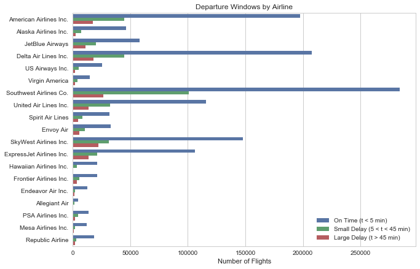
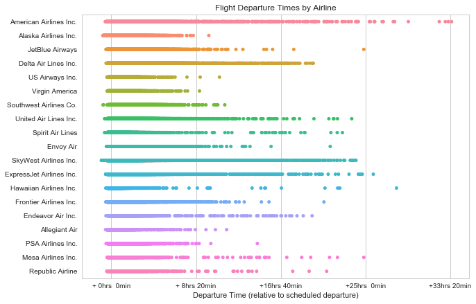
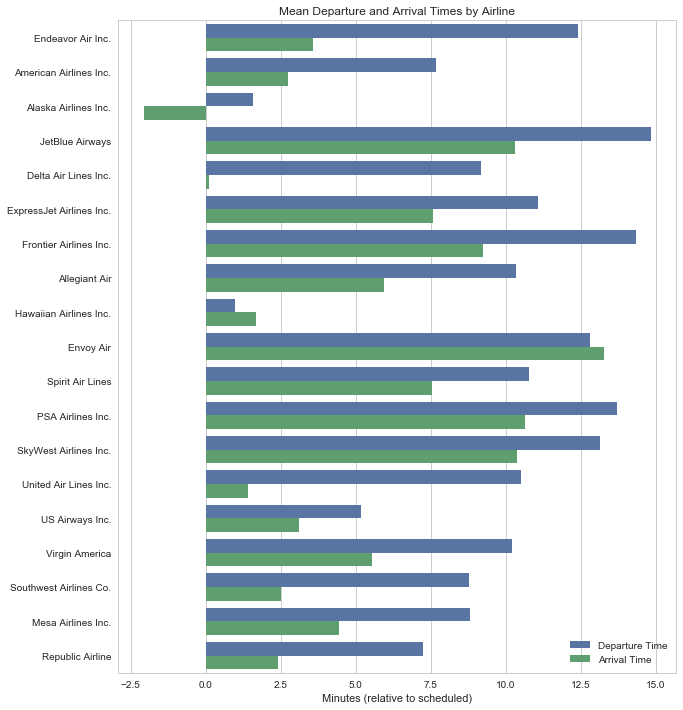
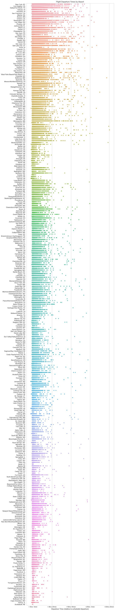
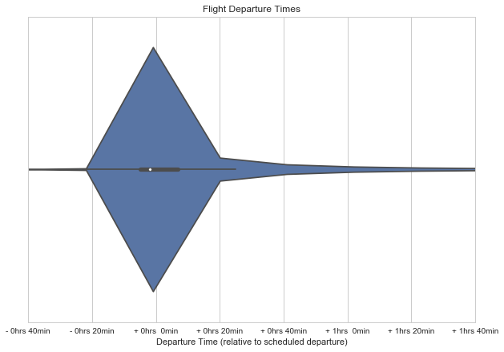
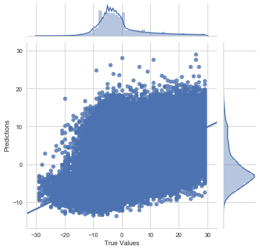
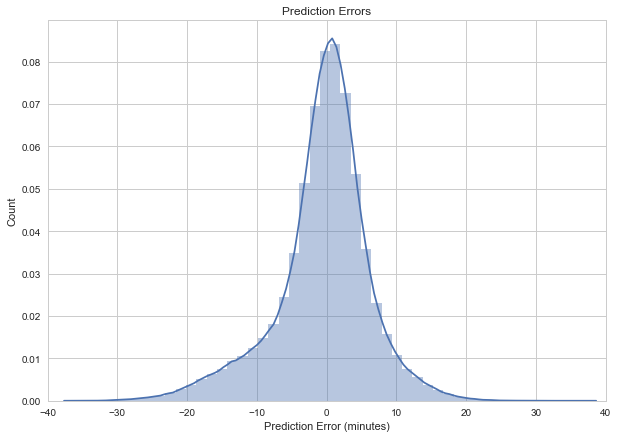

# Modeling Delays of US Domestic Flights

This notebook visualizes and predicts the relative departure times of domestic flights. The data is from the US Department of Transportation, available [here](http://www.transtats.bts.gov/DatabaseInfo.asp?DB_ID=120&DB_Name=Airline%20On-Time%20Performance%20Data).

## Importing, Cleaning and Visualizing the Data


```python
import glob
import numpy as np 
import sklearn
import pandas as pd
import matplotlib.pyplot as plt
import seaborn as sns
sns.set(style="whitegrid")

import warnings
warnings.filterwarnings("ignore")
```

### Importing the Data

All of the data from the Department of Transportation comes in directories like `data_YYYY_MM/data_YYYY_MM.csv`. So for each year, there are 12 unique csv files to be loaded. Here, we're loading just the january data from all the available years and combining it into one dataframe.  


```python
january_data = glob.glob('CarrierData/*/*_1.csv')

loaded_data = []

for path in january_data:
    this_data = pd.read_csv(path, skipinitialspace=True, low_memory=False)
    loaded_data.append(this_data)

df = pd.concat(loaded_data)
```

The airlines are represented as unique codes, so we need to import the lookup table from the DoT and create a dictionary.


```python
this_data = pd.read_csv('CarrierData/carriers.csv', skipinitialspace=True, low_memory=False)

airlines_lookup = this_data.set_index('Code')['Description'].to_dict()
```

### Cleaning the Data

Consolidating the dataframe to just contain the relevant columns:


```python
df = df[['Month', 'DayofMonth', 'DayOfWeek', 'Reporting_Airline', 'Origin', 'OriginCityName',
         'Dest', 'DepDelay', 'ArrDelay', 'CRSElapsedTime', 'CRSDepTime']]
```

There might be some missing data, so let's visualize that here. 


```python
missing = df.isnull().sum(axis=0).reset_index()
missing.columns = ['Variable', 'Missing Entries']
missing['Percent Complete'] = (df.shape[0] - missing['Missing Entries']) / df.shape[0]*100
missing.sort_values('Percent Complete').reset_index(drop = True)
```


<div>
  <table border="1" class="dataframe">
    <thead>
      <tr style="text-align: right;">
        <th></th>
        <th>Variable</th>
        <th>Missing Entries</th>
        <th>Percent Complete</th>
      </tr>
    </thead>
    <tbody>
      <tr>
        <th>0</th>
        <td>ArrDelay</td>
        <td>54476</td>
        <td>97.186055</td>
      </tr>
      <tr>
        <th>1</th>
        <td>DepDelay</td>
        <td>48994</td>
        <td>97.469227</td>
      </tr>
      <tr>
        <th>2</th>
        <td>CRSElapsedTime</td>
        <td>4</td>
        <td>99.999793</td>
      </tr>
      <tr>
        <th>3</th>
        <td>Month</td>
        <td>0</td>
        <td>100.000000</td>
      </tr>
      <tr>
        <th>4</th>
        <td>DayofMonth</td>
        <td>0</td>
        <td>100.000000</td>
      </tr>
      <tr>
        <th>5</th>
        <td>DayOfWeek</td>
        <td>0</td>
        <td>100.000000</td>
      </tr>
      <tr>
        <th>6</th>
        <td>Reporting_Airline</td>
        <td>0</td>
        <td>100.000000</td>
      </tr>
      <tr>
        <th>7</th>
        <td>Origin</td>
        <td>0</td>
        <td>100.000000</td>
      </tr>
      <tr>
        <th>8</th>
        <td>OriginCityName</td>
        <td>0</td>
        <td>100.000000</td>
      </tr>
      <tr>
        <th>9</th>
        <td>Dest</td>
        <td>0</td>
        <td>100.000000</td>
      </tr>
      <tr>
        <th>10</th>
        <td>CRSDepTime</td>
        <td>0</td>
        <td>100.000000</td>
      </tr>
    </tbody>
  </table>
</div>


Since the dataset is about 97% complete, we'll just drop any rows that are missing data. It won't result in too much of a loss.


```python
before = len(df.index)
df.dropna(inplace = True)
after = len(df.index)

diff = before - after

print("Removed {} entries out of {}".format(diff, before))
```

    Removed 54952 entries out of 1935930


### Visualization

Now, we can begin to visualize the data. We'll start by taking a look at the percentage of flights delayed and mean delay time for each airline.


```python
delay_type = lambda x:((0,1)[x > 5],2)[x > 45]
df['delay_amount'] = df['DepDelay'].apply(delay_type)

fig = plt.figure(1, figsize=(10,7))
plt.title('Departure Windows by Airline')
ax = sns.countplot(y='Reporting_Airline', hue='delay_amount', data=df)

df = df.drop(columns=['delay_amount'])

labels = [airlines_lookup[item.get_text()] for item in ax.get_yticklabels()]

ax.set_yticklabels(labels)

ax.yaxis.label.set_visible(False)
plt.xlabel('Number of Flights')

L = plt.legend(loc=4)
L.get_texts()[0].set_text('On Time (t < 5 min)')
L.get_texts()[1].set_text('Small Delay (5 < t < 45 min)')
L.get_texts()[2].set_text('Large Delay (t > 45 min)')
plt.show()
```





It appears as if the number of delayed flights scales with the size of the airline and how many flights they run, as one would expect. However, what is notable here is that there's a good amount of variation in delay times between *similarly sized airlines*. Hawaiian and Frontier are both similar sizes, but Frontier has more large delays. This indicates that the airline will be an important part of the model.

Next, we'll plot the overall distribution of departure times by airline.


```python
fig = plt.figure(1, figsize=(10,7))

plt.title('Flight Departure Times by Airline')

ax = sns.stripplot(y='Reporting_Airline', x='DepDelay', data=df)
ax.set_xticklabels(['+{:2.0f}hrs {:2.0f}min'.format(*[int(y) for y in divmod(x,60)]) for x in ax.get_xticks()])

labels = [airlines_lookup[item.get_text()] for item in ax.get_yticklabels()]

ax.set_yticklabels(labels)

plt.xlabel('Departure Time (relative to scheduled departure)')
ax.yaxis.label.set_visible(False)

plt.show()
```





This is a more telling visualization, as it ignores the size of the airline and just shows the overall departure time distribution for each. A tighter cluster towards the left of the graph is better, and there are clear differences between airlines once again. SkyWest, American, and Delta are of particluar note for their large distributions. 

Now let's look at the average departure and arrival times for each airline.


```python
fig = plt.figure(1, figsize=(10,12))
plt.title('Mean Departure and Arrival Times by Airline')

dept_data = dict()
arr_data = dict()

for carrier in airlines_lookup.keys():
    delays = df[df['Reporting_Airline'] == carrier]
    del_dep = delays['DepDelay']
    del_arr = delays['ArrDelay']
    
    if del_dep.count() > 0:
        dep = del_dep.sum() / del_dep.count()
        arr = del_arr.sum() / del_arr.count()
        dept_data[carrier] = [carrier, dep, 'Departing']
        arr_data[carrier] = [carrier, arr, 'Arriving']
    
temp = []
temp.append(pd.DataFrame.from_dict(dept_data, orient='index', columns=['carrier', 'time', 'dir']))
temp.append(pd.DataFrame.from_dict(arr_data, orient='index', columns=['carrier', 'time', 'dir']))

df_temp = pd.concat(temp)

ax = sns.barplot(y='carrier', x='time', hue='dir', data=df_temp)

labels = [airlines_lookup[item.get_text()] for item in ax.get_yticklabels()]

ax.set_yticklabels(labels)

plt.xlabel('Minutes (relative to scheduled)')
ax.yaxis.label.set_visible(False)

L = plt.legend()
L.get_texts()[0].set_text('Departure Time')
L.get_texts()[1].set_text('Arrival Time')

plt.show()
```





Most all airlines were able to reduce their arrival times despite later departure times. Delta, United and Alaska are notable outliers that were able to get close to or less than the original scheduled arrival time.

Now let's take a look at another possibly important variable- airport.


```python
fig = plt.figure(1, figsize=(10,70))

plt.title('Flight Departure Times by Airport')

ax = sns.stripplot(y='OriginCityName', x='DepDelay', data=df)
ax.set_xticklabels(['+{:2.0f}hrs {:2.0f}min'.format(*[int(y) for y in divmod(x,60)]) for x in ax.get_xticks()])

plt.xlabel('Departure Time (relative to scheduled departure)')
ax.yaxis.label.set_visible(False)

plt.show()
```





Here we can see a similar difference between airports. Of course, this is a bit misleading since the number of flights from each airport will play a role in delays, but it shows that airport will also play an important role in the model. An interesting observation from this graph: notice that Atlanta has a larger distribution of flight departure times than Chicago. This seems unintuitive at first; Chicago is further north and must deal with more severe winter weather, which would logically lead to more delays. However, recall the distributions of Delta and United. Delta had a much larger distribution than United. Atlanta is a large hub for Delta, while Chicago is a large hub for United. Here we find an interesting case of the two variables being intertwined. 

The above strip plots were a bit misleading in that they showed the entire distribution of possible flight departures, from 0 to 33 hours after scheduled departure time. Let's now take a look at when the majority of flights depart.


```python
fig = plt.figure(1, figsize=(10,7))

plt.title('Flight Departure Times')
ax = sns.violinplot(x=df['DepDelay'])
plt.xlim(-40, 100)

ax.set_xticklabels(['{}{:2.0f}hrs {:2.0f}min'.format(('-' if x < 0 else '+'),
                                                     *[int(y) for y in divmod(abs(x),60)]) for x in ax.get_xticks()])
plt.xlabel('Departure Time (relative to scheduled departure)')
plt.show()
```





The range between -20 and +20 minutes seems to be when the majority of flights leave, with the mean slightly less than zero. It will be important to ensure that the model is most accurate in this range, rather than trying to accurately predict over the 33 hour possible scale, as anything over 2 hours can safely be consitered an outlier. 

Let's take a closer look at the distribution.


```python
fig = plt.figure(1, figsize=(10,7))

plt.title('Flight Departure Times')
ax = sns.distplot(df['DepDelay'])
plt.xlim(-60, 200)

ax.set_xticklabels(['{}{:2.0f}hrs {:2.0f}min'.format(('-' if x < 0 else '+'),
                                                    *[int(y) for y in divmod(abs(x),60)]) for x in ax.get_xticks()])
plt.xlabel('Departure Time (relative to scheduled departure)')
plt.show()
```


## Building the Model

We'll use Tensorflow for good accuracy with a low(ish) amount of work, and to take advantage of that sweet GPU computing power.


```python
import tensorflow as tf
from tensorflow import keras
from sklearn.model_selection import train_test_split
from sklearn.preprocessing import LabelEncoder
```

### Method

The goal here is to predict flight departure times. That is, to predict the amount of time (in minutes, relative to scheduled departure time) that the plane will take to leave. Notice that the prediction does *not* need any specific boarding/departure time, as all the data that we're using is *relative.* So if a flight is supposed to leave at 10:30 and leaves at 10:38, we just know that it left 8 minutes late. In case it hasn't been clear above, flights that leave early are represented with negative departure times.

Another caveat: we will be predicting *average* departure times. That is, predicting flight times that are within the range that the majority of delays take place in; (-30 min, 40 min). This model will be useless when it comes to predicting really long delays, because the cause of these delays is often not implicit in the data.

This prediction relies on a number of features:

- Airline
- Origin airport
- Destination airport
- Scheduled flight duration
- Month
- Day of month
- Day of week
- Hour (maybe)

The problem with just predicting departure delays is that they aren't particularily representative of arrival delays, as shown in the visualization above. It would be nice for this application to provide this information as well. As such, we'll be building another model to predict arrival delays that uses the same features. 

Once we have the two predictions then we will be able to also predict the expected flight time. This can be done most simply by taking the expected route time and adding or subtracting both the expected arrival and departure delays.

### Cleaning MKII

There's a little more cleaning to be done here. We need to convert the airport IDs and Airline IDs to numerical codes so they can be fed into the model. 


```python
df = df.drop(columns=['OriginCityName'])

label_encoder = LabelEncoder()
integer_encoded = label_encoder.fit_transform(df['Origin'])
zipped = zip(df['Origin'], integer_encoded)
airports = dict(zipped)

df['Origin'] = df['Origin'].replace(to_replace=airports, value=None)
df['Dest'] = df['Dest'].replace(to_replace=airports, value=None)

label_encoder = LabelEncoder()
integer_encoded = label_encoder.fit_transform(df['Reporting_Airline'])
zipped = zip(df['Reporting_Airline'], integer_encoded)
airlines = dict(zipped)

df['Reporting_Airline'] = df['Reporting_Airline'].replace(to_replace=airlines, value=None)

label_encoder = LabelEncoder()
integer_encoded = label_encoder.fit_transform(df['CRSDepTime'])
zipped = zip(df['CRSDepTime'], integer_encoded)
dep_times = dict(zipped)

df['CRSDepTime'] = df['CRSDepTime'].replace(to_replace=dep_times, value=None)
```

For now, we're also dropping the elapsed time and arrival delay. 


```python
df = df[df['DepDelay'] < 30]  
df = df[df['DepDelay'] > -30]  

y = df['DepDelay']
X = df.drop(columns=['DepDelay', 'CRSElapsedTime', 'CRSDepTime'])
```

Just to check our dataframe to make sure it looks ok:


```python
X.head()
```


<div>
  <table border="1" class="dataframe">
    <thead>
      <tr style="text-align: right;">
        <th></th>
        <th>Month</th>
        <th>DayofMonth</th>
        <th>DayOfWeek</th>
        <th>Reporting_Airline</th>
        <th>Origin</th>
        <th>Dest</th>
        <th>ArrDelay</th>
      </tr>
    </thead>
    <tbody>
      <tr>
        <th>0</th>
        <td>1</td>
        <td>1</td>
        <td>4</td>
        <td>1</td>
        <td>170</td>
        <td>180</td>
        <td>7.0</td>
      </tr>
      <tr>
        <th>1</th>
        <td>1</td>
        <td>2</td>
        <td>5</td>
        <td>1</td>
        <td>170</td>
        <td>180</td>
        <td>-19.0</td>
      </tr>
      <tr>
        <th>2</th>
        <td>1</td>
        <td>3</td>
        <td>6</td>
        <td>1</td>
        <td>170</td>
        <td>180</td>
        <td>-39.0</td>
      </tr>
      <tr>
        <th>3</th>
        <td>1</td>
        <td>4</td>
        <td>7</td>
        <td>1</td>
        <td>170</td>
        <td>180</td>
        <td>-12.0</td>
      </tr>
      <tr>
        <th>4</th>
        <td>1</td>
        <td>5</td>
        <td>1</td>
        <td>1</td>
        <td>170</td>
        <td>180</td>
        <td>-8.0</td>
      </tr>
    </tbody>
  </table>
</div>


Now we split the data.


```python
X_train, X_test, y_train, y_test = train_test_split(X, y, test_size=0.2, random_state=42)

print(X_train[:5])
```

            Month  DayofMonth  DayOfWeek  Reporting_Airline  Origin  Dest  \
    299158      1          14          6                 13      88     2   
    27164       1           2          1                  3      40   152   
    330585      1           4          4                 16     188   302   
    380121      1          31          3                 16      18    87   
    384594      1          31          6                  4      18    69   
    
            ArrDelay  
    299158     -19.0  
    27164      -10.0  
    330585      14.0  
    380121     -12.0  
    384594     -12.0  


Normally this would be where we might do some normalization, but the model seems to converge regardless. 

### Regression

We'll use the `Sequential` model from Tensorflow with two hidden layers and one output layer to reurn a single continuous value. We need to use a model from keras to ensure that it can be saved as a json and loaded by tensorflow js.


```python
def build_model():
  model = keras.Sequential([
    keras.layers.Dense(64, activation=tf.nn.relu, input_shape=(X_train.shape[1],)),
    keras.layers.Dense(64, activation=tf.nn.relu),
    keras.layers.Dense(64, activation=tf.nn.relu),
    keras.layers.Dense(1)
  ])

  optimizer = tf.train.RMSPropOptimizer(0.001)
  model.compile(loss='mse', optimizer=optimizer, metrics=['mae'])

  return model

EPOCHS = 20

```

Now we can build and train the model. 


```python
model = build_model()
model.summary()

early_stop = keras.callbacks.EarlyStopping(monitor='val_loss', patience=10)

model.fit(X_train, y_train, epochs=EPOCHS, validation_split=0.33, verbose=1, callbacks=[early_stop], use_multiprocessing=True)

#tf.keras.models.save_model(model, 'models/december.json', overwrite=True, include_optimizer=True)
```

    _________________________________________________________________
    Layer (type)                 Output Shape              Param #   
    =================================================================
    dense (Dense)                (None, 64)                512       
    _________________________________________________________________
    dense_1 (Dense)              (None, 64)                4160      
    _________________________________________________________________
    dense_2 (Dense)              (None, 64)                4160      
    _________________________________________________________________
    dense_3 (Dense)              (None, 1)                 65        
    =================================================================
    Total params: 8,897
    Trainable params: 8,897
    Non-trainable params: 0
    _________________________________________________________________
    Train on 888764 samples, validate on 437750 samples
    Epoch 1/20
    888764/888764 [==============================] - 57s 64us/step - loss: 48.1138 - mean_absolute_error: 5.0309 - val_loss: 47.9076 - val_mean_absolute_error: 4.9436
    Epoch 2/20
    888764/888764 [==============================] - 54s 61us/step - loss: 47.2845 - mean_absolute_error: 4.9877 - val_loss: 47.2184 - val_mean_absolute_error: 4.9775
    Epoch 3/20
    888764/888764 [==============================] - 54s 61us/step - loss: 47.1248 - mean_absolute_error: 4.9784 - val_loss: 47.2409 - val_mean_absolute_error: 5.0019
    Epoch 4/20
    888764/888764 [==============================] - 54s 61us/step - loss: 47.0165 - mean_absolute_error: 4.9730 - val_loss: 47.5642 - val_mean_absolute_error: 5.0564
    Epoch 5/20
    888764/888764 [==============================] - 54s 61us/step - loss: 46.9018 - mean_absolute_error: 4.9663 - val_loss: 47.0623 - val_mean_absolute_error: 4.9860
    Epoch 6/20
    888764/888764 [==============================] - 54s 61us/step - loss: 46.7792 - mean_absolute_error: 4.9583 - val_loss: 47.1464 - val_mean_absolute_error: 4.9649
    Epoch 7/20
    888764/888764 [==============================] - 54s 61us/step - loss: 46.6862 - mean_absolute_error: 4.9522 - val_loss: 47.6952 - val_mean_absolute_error: 4.9378
    Epoch 8/20
    888764/888764 [==============================] - 54s 61us/step - loss: 46.5914 - mean_absolute_error: 4.9463 - val_loss: 46.5111 - val_mean_absolute_error: 4.9263
    Epoch 9/20
    888764/888764 [==============================] - 55s 61us/step - loss: 46.4997 - mean_absolute_error: 4.9393 - val_loss: 46.8197 - val_mean_absolute_error: 4.9233
    Epoch 10/20
    888764/888764 [==============================] - 54s 61us/step - loss: 46.4561 - mean_absolute_error: 4.9356 - val_loss: 46.3830 - val_mean_absolute_error: 4.9231
    Epoch 11/20
    888764/888764 [==============================] - 54s 61us/step - loss: 46.3606 - mean_absolute_error: 4.9298 - val_loss: 46.8473 - val_mean_absolute_error: 5.0083
    Epoch 12/20
    888764/888764 [==============================] - 54s 61us/step - loss: 46.2696 - mean_absolute_error: 4.9261 - val_loss: 46.4552 - val_mean_absolute_error: 4.9395
    Epoch 13/20
    888764/888764 [==============================] - 54s 61us/step - loss: 46.1727 - mean_absolute_error: 4.9208 - val_loss: 46.1863 - val_mean_absolute_error: 4.9005
    Epoch 14/20
    888764/888764 [==============================] - 54s 61us/step - loss: 46.1291 - mean_absolute_error: 4.9189 - val_loss: 46.0097 - val_mean_absolute_error: 4.8955
    Epoch 15/20
    888764/888764 [==============================] - 55s 61us/step - loss: 46.0600 - mean_absolute_error: 4.9163 - val_loss: 47.3980 - val_mean_absolute_error: 4.9946
    Epoch 16/20
    888764/888764 [==============================] - 54s 61us/step - loss: 46.0612 - mean_absolute_error: 4.9164 - val_loss: 45.8462 - val_mean_absolute_error: 4.9337
    Epoch 17/20
    888764/888764 [==============================] - 54s 61us/step - loss: 46.0878 - mean_absolute_error: 4.9171 - val_loss: 46.1666 - val_mean_absolute_error: 4.8848
    Epoch 18/20
    888764/888764 [==============================] - 54s 61us/step - loss: 46.0772 - mean_absolute_error: 4.9166 - val_loss: 46.9700 - val_mean_absolute_error: 4.9283
    Epoch 19/20
    888764/888764 [==============================] - 54s 60us/step - loss: 46.1041 - mean_absolute_error: 4.9184 - val_loss: 46.1682 - val_mean_absolute_error: 4.9351
    Epoch 20/20
    888764/888764 [==============================] - 53s 60us/step - loss: 46.1016 - mean_absolute_error: 4.9203 - val_loss: 46.3538 - val_mean_absolute_error: 4.8901


    <tensorflow.python.keras.callbacks.History at 0x2030c588908>


Now let's evaluate the model.


```python
def visualize_results(model):
    
    [loss, mae] = model.evaluate(X_test, y_test, verbose=0)
    
    test_predictions = model.predict(X_test).flatten()
    
    fig = plt.figure(1, figsize=(10,15))

    ax = sns.JointGrid(x=y_test, y=test_predictions)
    ax = ax.plot(sns.regplot, sns.distplot)
    plt.xlabel('True Values')
    plt.ylabel('Predictions')
    plt.show()
    
    fig = plt.figure(1, figsize=(10,7))

    plt.title('Prediction Errors')
    error = test_predictions - y_test
    ax = sns.distplot(error)
    plt.xlim(-40, 40)
    plt.xlabel("Prediction Error (minutes)")
    plt.ylabel("Count")
    plt.show()
    
    print("Mean Error: {} minutes".format(mae))
    print("Loss Value: {}".format(loss))

visualize_results(model)
```


    <Figure size 720x1080 with 0 Axes>








    Mean Error: 4.872393582594913 minutes
    Loss Value: 45.976186491640476


The model is pretty good, but not perfect. A mean error of 4.7 minutes means that predictions should be qualified with plus or minus 5 minutes. However, given the huge size of these data, it certainly is quite acceptable. Also, note that the model is slightly positively biased, so it will be a bit convervative in its estimates. This is a good thing, as it would be worse to report that a flight will be early to the user than late.

Let's determine exactly how accurate it is given a few different margins of error.


```python
test_predictions = model.predict(X_test).flatten()

within_error_1 = 0
within_error_2 = 0
within_error_3 = 0
total = 0
i = 0

for real in y_test:

    pred = test_predictions[i]
    
    if abs(pred - real) <= 20:
        within_error_1 += 1
        if abs(pred - real) <= 10:
            within_error_2 +=1
            if abs(pred-real) <= 5:
                within_error_3 += 1
    
    total += 1
    i += 1
    
print("Predictions accurate to 5 minutes {}%".format(within_error_3 / total * 100))
print("Predictions accurate to 10 minutes {}%".format(within_error_2 / total * 100))
print("Predictions accurate to 20 minutes {}%".format(within_error_1 / total * 100))
        
```

    Predictions accurate to 5 minutes 65.25153107840389%
    Predictions accurate to 10 minutes 86.67366243603544%
    Predictions accurate to 20 minutes 98.60356000229172%


## Wrap Up

We were able to make rather accurate flight departure time predictions from the data available from the US Department of Transportation. We started by cleaning and visualizing the data to look for important attributes and then trained a model using Tensorflow and Keras. This process is will be used for the models used to make predictions on [flygeni.us](https://flygeni.us)
